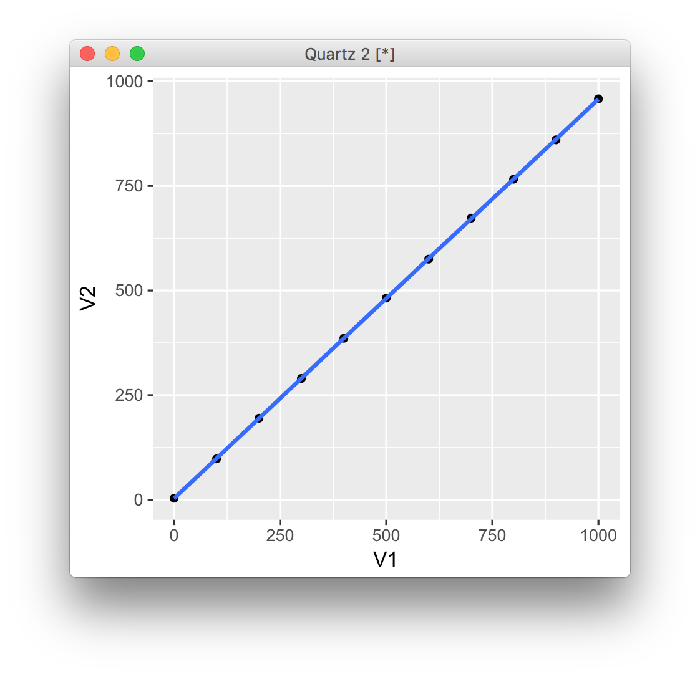

# pyroelectric-pi-esp8266


# Raspberry-pi side
```
./start-piserver.sh
```
Or explicitly,

```
ruby pi-server.rb -o 0.0.0.0
```
# Espr developer side
upload `human-sensor/human-sensor.ino` to the board

| Parameter | Value |
| ------------- | ------------- |
|Flash Mode	    |QIO|
|Flash Frequency	 |40MHz|
|CPU Frequency	|80MHz|
|Flash Size	|4M(3M SPIFFS)|
|Reset Method	|nodemcu|
|Upload Speed	|115200|

# ADC of ESP8266
- 0~1.0Vを10bitで取得する
 - ほぼ出力値のmVに等しい値を返す

校正式
```
Value = 1.049 * V[mV] - 4.190
```

# Materials
### 焦電型赤外線（人感）センサーモジュール　ＳＢ４１２Ａ

[http://akizukidenshi.com/catalog/g/gM-09002/](http://akizukidenshi.com/catalog/g/gM-09002/)

### ESPr® Developer（ESP-WROOM-02開発ボード

[https://www.switch-science.com/catalog/2500/](https://www.switch-science.com/catalog/2500/)
