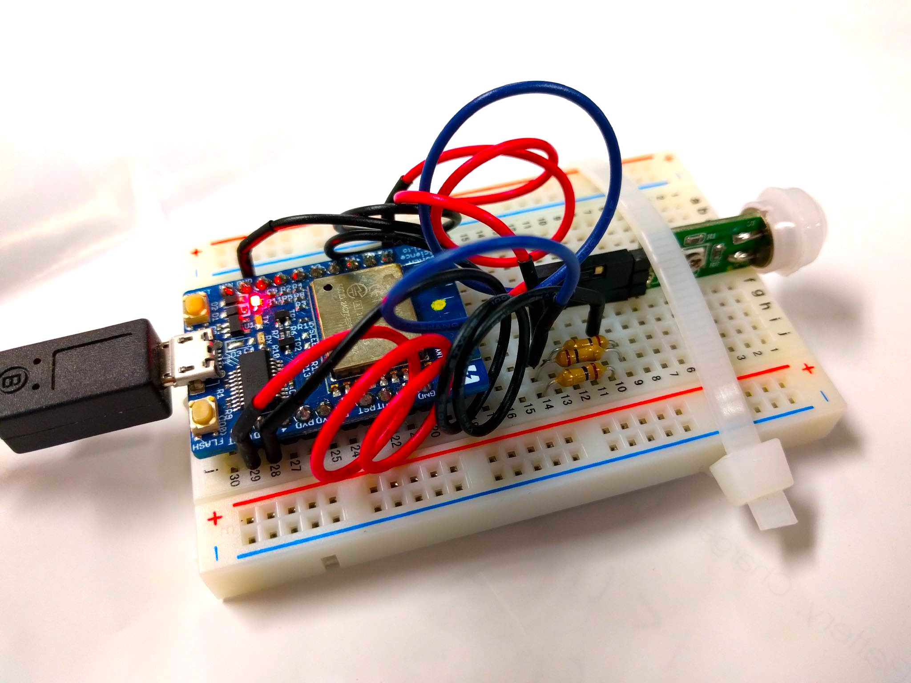

# pyroelectric-pi-esp8266



# Raspberry-pi side
```
./start-piserver.sh
```
Or explicitly,

```
ruby pi-server.rb -o 0.0.0.0
```
# Espr developer side
upload `human-sensor/human-sensor.ino` to the board